# CodeSheet – AI-Powered Website Builder & Code Generation Agent

CodeSheet is an AI-driven website builder that transforms natural language prompts into production-ready React components and full-stack web applications. Built with a modern AI-first architecture, CodeSheet enables developers to design, generate, execute, and preview applications in real time—significantly accelerating development workflows and reducing manual coding effort.

## Why CodeSheet?

Modern web development is powerful but time-consuming. Developers often spend excessive effort on:
- Repetitive UI component creation
- Boilerplate project setup
- Manual debugging and testing
- Switching between tools for generation, execution, and preview

CodeSheet eliminates these inefficiencies by combining AI-based code generation, secure execution, and live preview into a single intelligent platform.

## Problem Statement

```
Hours of setup → Boilerplate hell → Context switching → Bugs
Manual coding  → Copy-paste fatigue → Slow iteration → Frustration
```
Developers waste 80% time on repetitive tasks instead of building features.

Traditional website development faces several challenges:
- High development time for repetitive UI and full-stack scaffolding
- Limited reusability of generated components
- Unsafe or unisolated environments for executing AI-generated code
- Slow iteration cycles during testing and debugging
- Difficulty translating natural language ideas into working code

## Solution Statement

CodeSheet provides an **AI-powered development agent** that:
- Converts plain English prompts into **React components and Next.js applications**
- Generates **reusable, modular** UI components
- Executes code securely using **Docker-based sandboxing** and cloud environments
- Offers **live previews** for immediate feedback
- Enables faster iteration and parallel development across multiple projects

This results in a seamless **prompt-to-production** workflow.

## Key Features

🧠 AI-driven code generation from natural language prompts

⚛️ Automatic generation of React and Next.js components

♻️ Reusable UI component creation, boosting development speed by ~50%

🐳 Docker-based sandboxing for secure code execution

☁️ E2B cloud environments for live preview and testing

⚡ Real-time feedback loop for rapid iteration

🧩 Scalable architecture supporting multiple simultaneous projects

## Screenshots

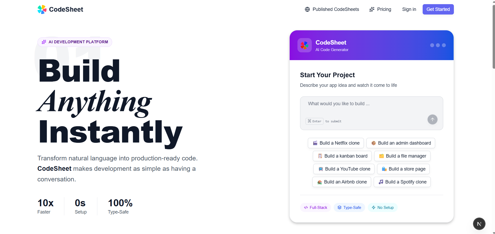
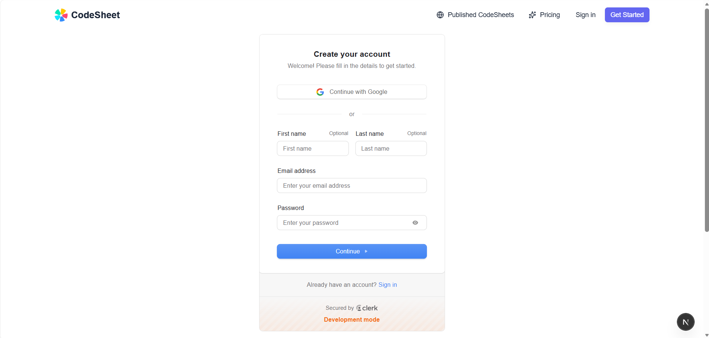
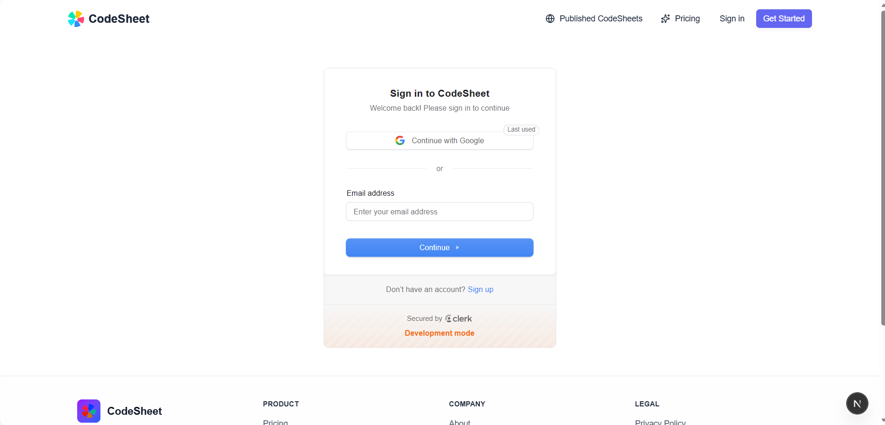

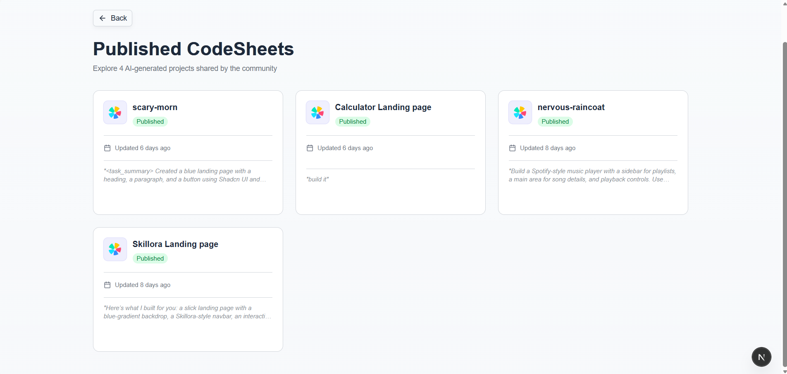
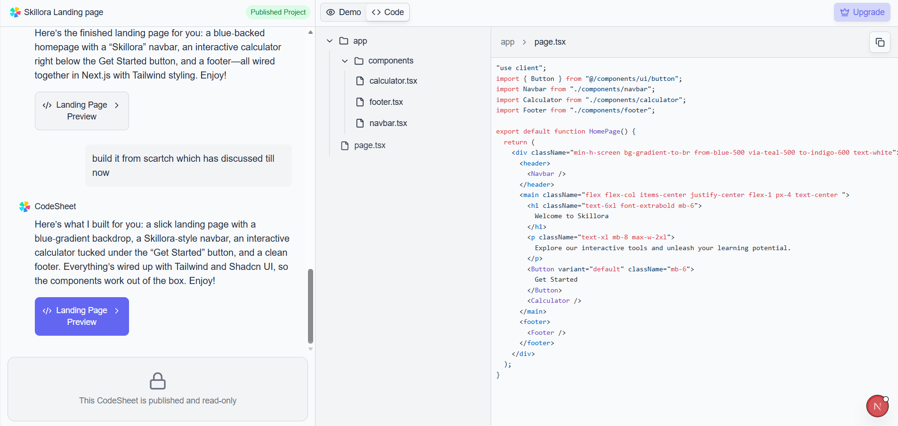


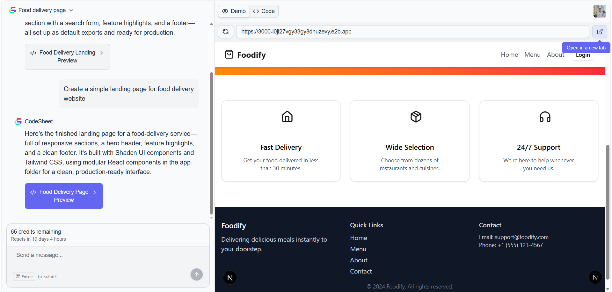
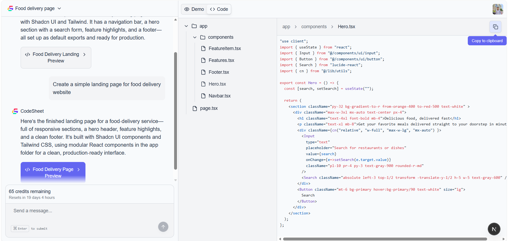
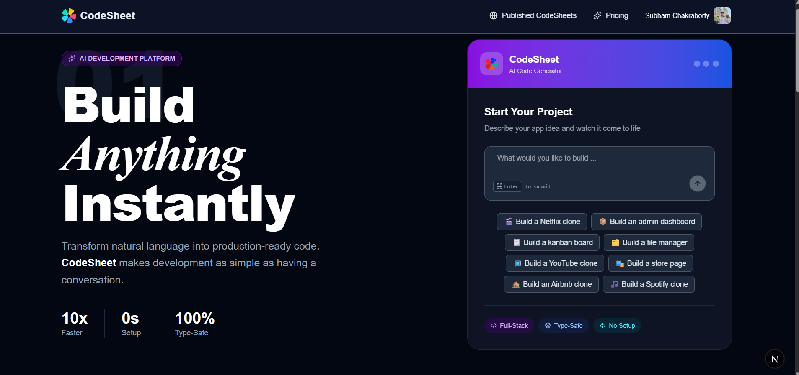
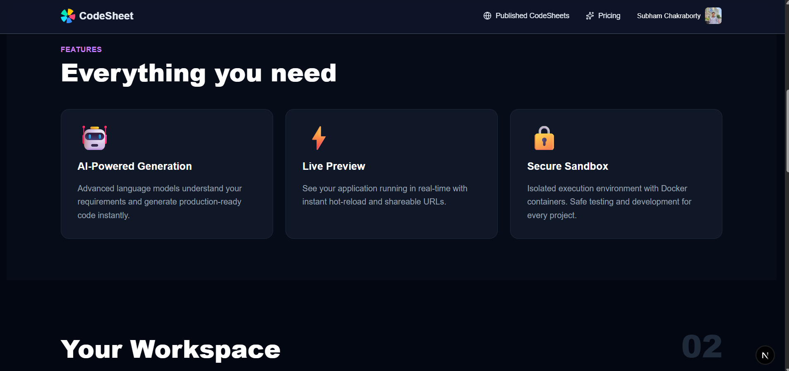
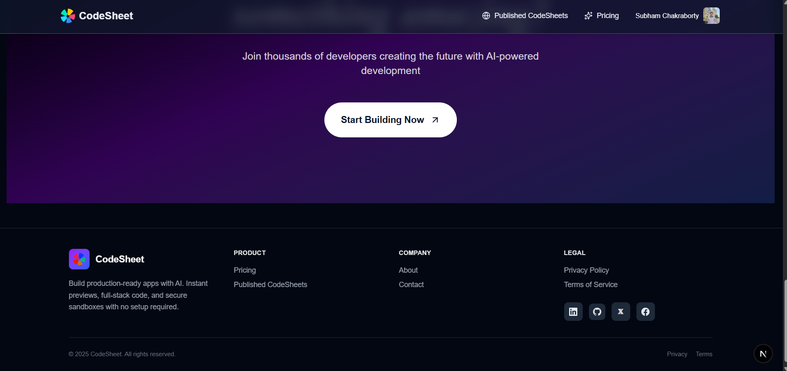
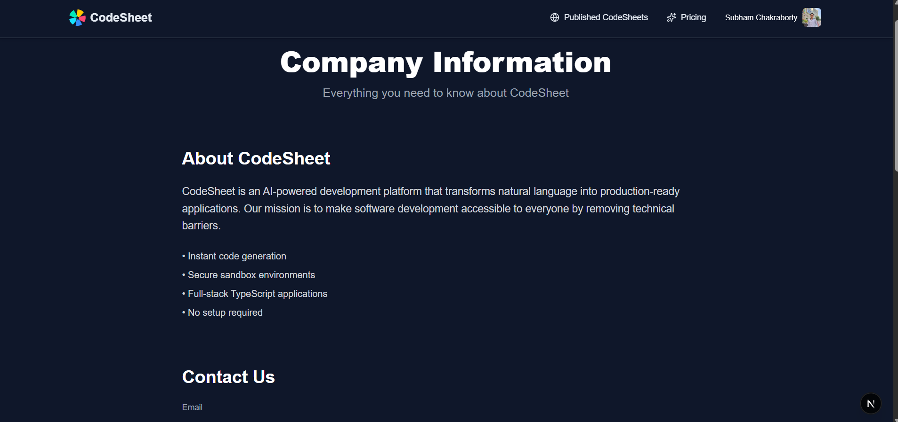
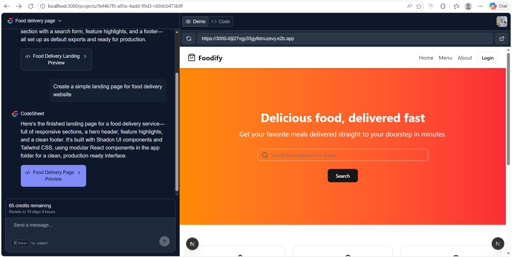
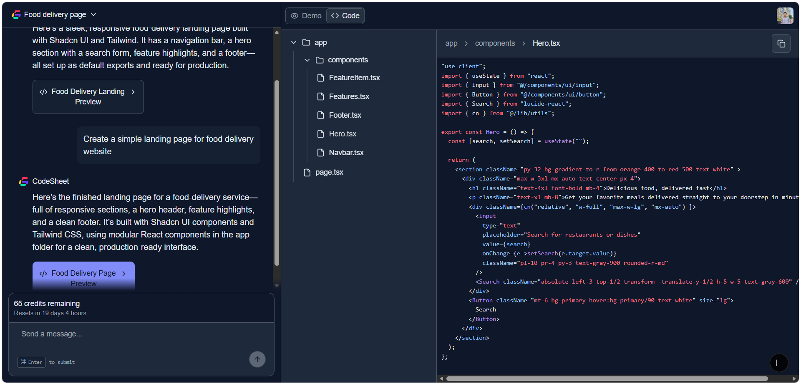

## Project Structure
```
codesheet/
├── prisma/                     # Database schema and migrations
│   └── schema.prisma
│
├── public/                     # Static assets (logo, images)
|   ├── assets
│   └── logo.svg
│
├── sandbox-templates/           # Docker & E2B templates for secure code execution
|   └── nextjs/
│           ├── compile_page.sh
│           ├── e2b.Dockerfile
│           └── e2b.toml
│
├── src/
│   ├── app/                     # Next.js 14 App Router
│   │   ├── (home)/              # Landing page layout and routes
│   │   ├── info/                # Product / company information pages
│   │   ├── api/                 # API route handlers
│   │   ├── layout.tsx
│   │   └── globals.css          # Tailwind CSS and global styles
│   │
│   ├── components/              # Reusable UI components
│   │
│   ├── generated/               # generated code prisma
│   │   └── prisma/
│   │
│   ├── hooks/                   # Custom React hooks
│   │
│   ├── inngest/                 # Background jobs and event-driven workflows
│   │   ├── client.ts            # Inngest client configuration
│   │   └── functions.ts         # Async AI and sandbox tasks
│   │
│   ├── lib/                     # Core utilities and helpers
│   │   ├── utils.ts
│   │   ├── usage.ts
│   │   └── db.ts
│   │
│   ├── modules/                 # Feature-based modules
│   │   └── home/                # Home page feature logic
│   │       ├── ui/
│   │       └── constants.ts
│   │
│   ├── trpc/                    # tRPC API definitions
│   │   ├── routers/
│   │   ├── client.tsx
|   |   └── server.tsx
│   │
│   ├── prompt.ts                # AI prompt templates and instructions
│   └── middleware.ts            # Authentication & request middleware
│
├── package.json                 # Project dependencies and scripts
├── README.md                    # Project documentation
└── .env                         # Environment variable template
```
## Getting Started
### Prerequisites
Make sure you have the following installed:
- Node.js (v18+)
- npm 
- Docker
- Git
- Internet access for AI model APIs

### Project Setup
1. Clone the repository
```bash
https://github.com/Subham62/CodeSheet.git
```

2. Navigate to the project directory
```bash
cd codesheet
```

3. Install dependencies
```bash
npm install
```
4. Run the development server
```bash
npm run dev
```

5. Open your browser at:
```
http://localhost:3000
```

## Technologies Used
### Frontend

- **Next.js 15** – App Router–based framework for scalable, server-driven applications

- **React 19** – Modern UI rendering and component architecture

- **Tailwind CSS v4** – Utility-first styling for rapid UI development

- **shadcn/ui** – Accessible, reusable UI components

### Backend & APIs

- **tRPC** – End-to-end type-safe APIs for full-stack development

- **Inngest** – Background jobs, workflows, and agent orchestration

### AI & Automation

- **AI Model Providers** – OpenAI, Anthropic, Grok

- **Inngest Agent Toolkit** – AI agent execution and task coordination

### Infrastructure & Execution

- **E2B Cloud Sandboxes** – Secure, isolated runtime environments

- **Docker** – Containerized sandbox templates for consistent execution

### Authentication & Billing

- **Clerk Authentication** – Secure user management

- **Clerk Billing** – Subscription and credit-based billing workflows

## Database & Tooling

- **Prisma** – Type-safe ORM

- **Neon** – Serverless PostgreSQL database

- **CodeRabbit** – AI-powered pull request reviews

## Contribution Guidelines
We welcome contributions to enhance and improve the application.
If you have ideas or improvements, feel free to submit a **pull request** following standard contribution practices.

## Feedback and Issues
If you encounter any issues or have feedback, please open an issue on the *GitHub* repository.
Your input helps improve Mentiv with every update.

⭐ If roadmap-driven learning makes sense to you, consider starring this repository.

## Acknowledgments
- Inspiration from modern AI-driven developer tools
- Open-source communities advancing web and AI technologies
- Cloud and containerization ecosystems enabling secure execution
- Mentors and peers emphasizing automation-first development